```python
import numpy as np
import pandas as pd
import copy
pd.set_option('display.notebook_repr_html', False)
from matplotlib import pyplot as plt
from scipy import signal
from IPython.display import Markdown
from IPython.core.debugger import set_trace as breakpt
```

# Day 20: Jurassic Jigsaw

Reference: https://adventofcode.com/2020/day/20

## Part 1

The high-speed train leaves the forest and quickly carries you south. You can even see a desert in the distance! Since you have some spare time, you might as well see if there was anything interesting in the image the Mythical Information Bureau satellite captured.

After decoding the satellite messages, you discover that the data actually contains many small images created by the satellite's camera array. The camera array consists of many cameras; rather than produce a single square image, they produce many smaller square image tiles that need to be reassembled back into a single image.

Each camera in the camera array returns a single monochrome image tile with a random unique ID number. The tiles (your puzzle input) arrived in a random order.

Worse yet, the camera array appears to be malfunctioning: each image tile has been rotated and flipped to a random orientation. Your first task is to reassemble the original image by orienting the tiles so they fit together.

To show how the tiles should be reassembled, each tile's image data includes a border that should line up exactly with its adjacent tiles. All tiles have this border, and the border lines up exactly when the tiles are both oriented correctly. Tiles at the edge of the image also have this border, but the outermost edges won't line up with any other tiles.

For example, suppose you have the following nine tiles:
```
Tile 2311:
..##.#..#.
##..#.....
#...##..#.
####.#...#
##.##.###.
##...#.###
.#.#.#..##
..#....#..
###...#.#.
..###..###

Tile 1951:
#.##...##.
#.####...#
.....#..##
#...######
.##.#....#
.###.#####
###.##.##.
.###....#.
..#.#..#.#
#...##.#..

Tile 1171:
####...##.
#..##.#..#
##.#..#.#.
.###.####.
..###.####
.##....##.
.#...####.
#.##.####.
####..#...
.....##...

Tile 1427:
###.##.#..
.#..#.##..
.#.##.#..#
#.#.#.##.#
....#...##
...##..##.
...#.#####
.#.####.#.
..#..###.#
..##.#..#.

Tile 1489:
##.#.#....
..##...#..
.##..##...
..#...#...
#####...#.
#..#.#.#.#
...#.#.#..
##.#...##.
..##.##.##
###.##.#..

Tile 2473:
#....####.
#..#.##...
#.##..#...
######.#.#
.#...#.#.#
.#########
.###.#..#.
########.#
##...##.#.
..###.#.#.

Tile 2971:
..#.#....#
#...###...
#.#.###...
##.##..#..
.#####..##
.#..####.#
#..#.#..#.
..####.###
..#.#.###.
...#.#.#.#

Tile 2729:
...#.#.#.#
####.#....
..#.#.....
....#..#.#
.##..##.#.
.#.####...
####.#.#..
##.####...
##..#.##..
#.##...##.

Tile 3079:
#.#.#####.
.#..######
..#.......
######....
####.#..#.
.#...#.##.
#.#####.##
..#.###...
..#.......
..#.###...
```
By rotating, flipping, and rearranging them, you can find a square arrangement that causes all adjacent borders to line up:
```
#...##.#.. ..###..### #.#.#####.
..#.#..#.# ###...#.#. .#..######
.###....#. ..#....#.. ..#.......
###.##.##. .#.#.#..## ######....
.###.##### ##...#.### ####.#..#.
.##.#....# ##.##.###. .#...#.##.
#...###### ####.#...# #.#####.##
.....#..## #...##..#. ..#.###...
#.####...# ##..#..... ..#.......
#.##...##. ..##.#..#. ..#.###...

#.##...##. ..##.#..#. ..#.###...
##..#.##.. ..#..###.# ##.##....#
##.####... .#.####.#. ..#.###..#
####.#.#.. ...#.##### ###.#..###
.#.####... ...##..##. .######.##
.##..##.#. ....#...## #.#.#.#...
....#..#.# #.#.#.##.# #.###.###.
..#.#..... .#.##.#..# #.###.##..
####.#.... .#..#.##.. .######...
...#.#.#.# ###.##.#.. .##...####

...#.#.#.# ###.##.#.. .##...####
..#.#.###. ..##.##.## #..#.##..#
..####.### ##.#...##. .#.#..#.##
#..#.#..#. ...#.#.#.. .####.###.
.#..####.# #..#.#.#.# ####.###..
.#####..## #####...#. .##....##.
##.##..#.. ..#...#... .####...#.
#.#.###... .##..##... .####.##.#
#...###... ..##...#.. ...#..####
..#.#....# ##.#.#.... ...##.....
```
For reference, the IDs of the above tiles are:
```
1951    2311    3079
2729    1427    2473
2971    1489    1171
```
To check that you've assembled the image correctly, multiply the IDs of the four corner tiles together. If you do this with the assembled tiles from the example above, you get 1951 * 3079 * 2971 * 1171 = 20899048083289.

Assemble the tiles into an image. What do you get if you multiply together the IDs of the four corner tiles?


```python
trdict = {'.': '0', '#': '1'}
puzpiece = list()
puzdict = dict()
with open('puzzle_input.txt', 'r') as fid:
    for line in fid:
        if not line.strip():
            # Empty line. Flush the data
            puzdict[tileid] = puzpiece
            puzpiece = list()
            continue
        if line.startswith('Tile'):
            tileid = int(line.split()[1][:-1])
            continue
        # Assume line is puzzle piece data
        puzpiece.append(''.join([trdict[x] for x in line.strip()]))
        
```


```python
# Convert string puzzle pieces to numpy arrays
puzdict2 = dict()
for k, v in puzdict.items():
    puzdict2[k] = np.array([[int(x) for x in r] for r in v], dtype=np.uint8)
```


```python
def get_int(arr):
    # Return the decimal integer for the
    # supplied 1-D arr of 0's & 1's
    return int(''.join([str(x) for x in arr]), 2)

def get_edges(arr):
    # Treat array edges as binary number and
    # get all possible values for each edges
    # read forwards and backwards (accounts for
    # possible rotations and flips)
    edgelist = list()
    edgelist.append(get_int(arr[0]))
    edgelist.append(get_int(arr[0][::-1]))
    edgelist.append(get_int(arr[-1]))
    edgelist.append(get_int(arr[-1][::-1]))
    edgelist.append(get_int(arr[:, 0]))
    edgelist.append(get_int(arr[:, 0][::-1]))
    edgelist.append(get_int(arr[:, -1]))
    edgelist.append(get_int(arr[:, -1][::-1]))
    return edgelist
```


```python
# Get all possible edge values for puzzle pieces
puzedges = {k: get_edges(v) for k, v in puzdict2.items()}
df = pd.DataFrame(puzedges)
df
```


       1409  2939  3347  1297  3203  1283  1879  2293  3079  1069  ...  3217  \
    0   810    11   101   603   980   968  1012   733   736   352  ...   228   
    1   339   832   664   873   175    79   191   749    29    26  ...   156   
    2   710  1017  1021    91   721   743   634   319   686   692  ...    69   
    3   397   639   767   872   557   925   377  1010   469   181  ...   648   
    4   977   361   115   930   987   913   525   660   531   151  ...   102   
    5   559   602   824   279   879   551   705   165   801   932  ...   408   
    6   148   767   529   881   229   357   316   821    28    64  ...   457   
    7   164  1021   545   571   668   666   242   691   224     8  ...   590   
    
       1861  3593  3041  2647  2437  3709  2039  3011  1151  
    0   990   439   925   751   392  1019   882   104   421  
    1   495   950   743   989    70   895   315    88   662  
    2   768   129   483   673   713   177   981   526   660  
    3     3   516   798   533   589   564   687   449   165  
    4   655   100   628   881   363   940   631   205   313  
    5   965   152   185   571   858   215   953   716   626  
    6     8   941   605   827   387   711   479   428   890  
    7    64   727   745   883   774   909  1006   214   379  
    
    [8 rows x 144 columns]


```python
# Any puzzle piece with 2 unique edges is a corner piece
# With flip and rotation then we would expect 4 unique
# edges for a corner piece
corners = dict()
for colnum in df:
    colvals = set(df[colnum])
    othervals = set(df.drop(colnum, axis=1).values.ravel())
    nmissing = len(colvals - othervals)
    if nmissing > 3:
        # Must be a corner piece
        corners[colnum] = colvals - othervals
        
corners
```


    {3607: {62, 281, 496, 610},
     1697: {167, 371, 826, 916},
     2731: {68, 136, 294, 402},
     1399: {123, 321, 522, 888}}


```python
mx = 1
for k in corners.keys():
    mx *= k
Markdown("The product of the 4 corner pieces is **{}**".format(mx))
```


The product of the 4 corner pieces is **23386616781851**


## Part Two

Now, you're ready to check the image for sea monsters.

The borders of each tile are not part of the actual image; start by removing them.

In the example above, the tiles become:
```
.#.#..#. ##...#.# #..#####
###....# .#....#. .#......
##.##.## #.#.#..# #####...
###.#### #...#.## ###.#..#
##.#.... #.##.### #...#.##
...##### ###.#... .#####.#
....#..# ...##..# .#.###..
.####... #..#.... .#......

#..#.##. .#..###. #.##....
#.####.. #.####.# .#.###..
###.#.#. ..#.#### ##.#..##
#.####.. ..##..## ######.#
##..##.# ...#...# .#.#.#..
...#..#. .#.#.##. .###.###
.#.#.... #.##.#.. .###.##.
###.#... #..#.##. ######..

.#.#.### .##.##.# ..#.##..
.####.## #.#...## #.#..#.#
..#.#..# ..#.#.#. ####.###
#..####. ..#.#.#. ###.###.
#####..# ####...# ##....##
#.##..#. .#...#.. ####...#
.#.###.. ##..##.. ####.##.
...###.. .##...#. ..#..###
```
Remove the gaps to form the actual image:
```
.#.#..#.##...#.##..#####
###....#.#....#..#......
##.##.###.#.#..######...
###.#####...#.#####.#..#
##.#....#.##.####...#.##
...########.#....#####.#
....#..#...##..#.#.###..
.####...#..#.....#......
#..#.##..#..###.#.##....
#.####..#.####.#.#.###..
###.#.#...#.######.#..##
#.####....##..########.#
##..##.#...#...#.#.#.#..
...#..#..#.#.##..###.###
.#.#....#.##.#...###.##.
###.#...#..#.##.######..
.#.#.###.##.##.#..#.##..
.####.###.#...###.#..#.#
..#.#..#..#.#.#.####.###
#..####...#.#.#.###.###.
#####..#####...###....##
#.##..#..#...#..####...#
.#.###..##..##..####.##.
...###...##...#...#..###
```
Now, you're ready to search for sea monsters! Because your image is monochrome, a sea monster will look like this:
```
                  # 
#    ##    ##    ###
 #  #  #  #  #  #   
```
When looking for this pattern in the image, the spaces can be anything; only the # need to match. Also, you might need to rotate or flip your image before it's oriented correctly to find sea monsters. In the above image, after flipping and rotating it to the appropriate orientation, there are two sea monsters (marked with O):
```
.####...#####..#...###..
#####..#..#.#.####..#.#.
.#.#...#.###...#.##.O#..
#.O.##.OO#.#.OO.##.OOO##
..#O.#O#.O##O..O.#O##.##
...#.#..##.##...#..#..##
#.##.#..#.#..#..##.#.#..
.###.##.....#...###.#...
#.####.#.#....##.#..#.#.
##...#..#....#..#...####
..#.##...###..#.#####..#
....#.##.#.#####....#...
..##.##.###.....#.##..#.
#...#...###..####....##.
.#.##...#.##.#.#.###...#
#.###.#..####...##..#...
#.###...#.##...#.##O###.
.O##.#OO.###OO##..OOO##.
..O#.O..O..O.#O##O##.###
#.#..##.########..#..##.
#.#####..#.#...##..#....
#....##..#.#########..##
#...#.....#..##...###.##
#..###....##.#...##.##.#
```
Determine how rough the waters are in the sea monsters' habitat by counting the number of # that are not part of a sea monster. In the above example, the habitat's water roughness is 273.

How many # are not part of a sea monster?


```python
# Looks like I really do have to perform the assembly.
# Make a class to hold all the necessary data and methods...
class PuzzPieces(object):
    """
    Data structure for holding puzzle pieces
    and provide convenient methods for accessing
    and assembling them.
    """
    def __init__(self, puzdict):
        """
        Parameters
        ----------
        puzdict: dict
            Dictionary of key ids for the puzzle pieces
            and values of 2D numpy array of 0's & 1's
            representing each piece
        """
        self._puzdict = puzdict
        # Get all possible edge values for puzzle pieces
        puzedges = {k: self.get_edges(v) for k, v in puzdict.items()}
        self._puzedges = pd.DataFrame(puzedges)
        self._edgeids = dict()
        self._build_edgelookup()
        # Create a set of unused pieces from which to choose when constructing
        self.unused = set(self.puzdict.keys())
        # Array to hold the puzzle assembly ids
        self.assembly = np.zeros((12, 12), dtype=np.uint16)
        # Lists to hold array pieces rotated into place
        self.list_assembly = list()
        # PUZZLE PIECES ASSEMBLE!
        self.list_of_rows = list()
        self.assemble()
        
    def sub_assemble(self, r, c, pcarr, side='bottom'):
        """
        Find and place the piece for r, c that will match
        the supplied piece-array along piece-array's side
        """
        if 'bottom' == side:
            edgefn = self.get_bottom_edgeid
            match_to_side = 'top'
        elif 'right' == side:
            edgefn = self.get_right_edgeid
            match_to_side = 'left'
        else:
            raise ValueError("Unhandled side: {}".format(side))

        # Find matching piece for pcid
        edgeid = edgefn(pcarr)
        id1 = self.find_match(edgeid)
        pc1 = self.get_arr(id1)
        
        # Assign it to the assembly
        self.assembly[r][c] = id1
        # Drop it from unused
        self.unused.discard(id1)
        # Now transform as necessary so the edges will mesh
        pc1 = self.tx_to_fit(pc1, edgefn(pcarr), side=match_to_side)
        # Return the transformed array
        return pc1
    
    def assemble(self):
        """
        Assemble the puzzle. From earlier we've already identified
        the corner pieces. Prime the array with a known corner
        piece and work to fill it out from there
        """
        row_list = list()
        id0 = 3607
        
        # Assign it to the assembly
        self.assembly[0][0] = id0
        # Drop it from unused
        self.unused.discard(id0)
        # Get the piece array
        pc0 = self.get_arr(id0)
        # Add it to the row_list
        row_list.append(pc0)

        # Construct the first row
        ii = np.ndindex((1, 12))
        # Throw out (0, 0) since we've manually placed it already
        next(ii)
        for r, c in ii:
            #print("Row: {} Col: {}".format(r, c))
            pcarr = row_list[-1]
            pc1 = self.sub_assemble(r, c, pcarr, 'right')
            row_list.append(pc1)
            
        self.list_of_rows.append(row_list)
        row_list = list()
        # With the first row constructed we can now iterate
        # over all the rest of the puzzle locations matching
        # pieces to the piece above
        ii = np.ndindex((12, 12))
        rprev = 1 # Help identify when a new row is started
        for r, c in ii:
            if 0 == r:
                # Already populated first row. Nothing to do
                continue
            if r > rprev:
                # Commit the row_list to list_of_rows and flush
                self.list_of_rows.append(row_list)
                row_list = list()
                rprev = r
            # Fit the next piece
            pcarr = self.list_of_rows[-1][c]
            pc1 = self.sub_assemble(r, c, pcarr, 'bottom')
            row_list.append(pc1)               
        # Don't forget to append the last row
        self.list_of_rows.append(row_list)
        
    def tx_to_fit(self, arr, edgeid, side='top'):
        """
        Transform the supplied arr until the requested
        edgeid appears along side (top or left). Return
        the transformed array.
        """
        if 'top' == side:
            getfn = self.get_top_edgeid
        elif 'left' == side:
            getfn = self.get_left_edgeid
        arr1 = arr.copy()
        # First try rotating all around
        for _ in range(4):
            edgeid1 = getfn(arr1)
            if edgeid1 == edgeid:
                # MATCH
                return arr1
            arr1 = np.rot90(arr1)
        # Still here? didn't match, flip and rotate
        arr1 = np.fliplr(arr1)
        # Try rotating around again
        for _ in range(4):
            edgeid1 = getfn(arr1)
            if edgeid1 == edgeid:
                # MATCH
                return arr1
            arr1 = np.rot90(arr1)
        # Still here? Never found a match
        raise ValueError("No match found for {}".format(edgeid))
        
    def find_match(self, edgeid):
        """
        Use the supplied edgeid to find and return the
        puzzle piece id that matches it
        """
        match = self.edgeids[edgeid] & self.unused
        #print(edgeid, match)
        if 1 < len(match):
            raise ValueError("More than 1 match found")
        return next(iter(match))
        
    @staticmethod
    def get_int(arr):
        """
        Return the decimal integer for the
        supplied 1-D arr of 0's & 1's
        """
        return int(''.join([str(x) for x in arr]), 2)

    @staticmethod
    def get_top_edgeid(arr, flip=False):
        """
        From the supplied array, return the id for its
        top edge
        """
        if not flip:
            return get_int(arr[0])
        else:
            return get_int(arr[0][::-1])
        
    @staticmethod
    def get_bottom_edgeid(arr, flip=False):
        """
        From the supplied array, return the id for its
        bottom edge
        """
        if not flip:
            return get_int(arr[-1])
        else:
            return get_int(arr[-1][::-1])

    @staticmethod
    def get_right_edgeid(arr, flip=False):
        """
        From the supplied array, return the id for its
        right edge
        """
        if not flip:
            return get_int(arr[:, -1])
        else:
            return get_int(arr[:, -1][::-1])

    @staticmethod
    def get_left_edgeid(arr, flip=False):
        """
        From the supplied array, return the id for its
        left edge
        """
        if not flip:
            return get_int(arr[:, 0])
        else:
            return get_int(arr[:, 0][::-1])

    def get_edges(self, arr):
        """
        Treat array edges as binary number and
        get all possible values for each edges
        read forwards and backwards (accounts for
        possible rotations and flips)
        """
        edgelist = list()
        edgelist.append(self.get_top_edgeid(arr))
        edgelist.append(self.get_top_edgeid(arr, flip=True))
        edgelist.append(self.get_bottom_edgeid(arr))
        edgelist.append(self.get_bottom_edgeid(arr, flip=True))
        edgelist.append(self.get_left_edgeid(arr))
        edgelist.append(self.get_left_edgeid(arr, flip=True))
        edgelist.append(self.get_right_edgeid(arr))
        edgelist.append(self.get_right_edgeid(arr, flip=True))
        return edgelist
   
    @property
    def puzdict(self):
        """
        Dictionary keyed on puzzle id with values of
        2D numpy array of 0's and 1's
        """
        return self._puzdict
    
    def get_arr(self, pcid):
        """
        Return the 2D array for the supplied pcid
        """
        return self.puzdict[pcid]
    
    @property
    def puzedges(self):
        """
        DataFrame of puzzle piece ids with all possible associated
        edge ids
        """
        return self._puzedges
    
    def _build_edgelookup(self):
        """
        Create a reverse lookup on puzz edges so we can ask for
        any edge and get that piece id in retturn
        """
        for i, ser in self.puzedges.iteritems():
            for edge in ser:
                if edge in self._edgeids:
                    self._edgeids[edge].add(i)
                else:
                    self._edgeids[edge] = {i}
                
    @property
    def edgeids(self):
        """
        Dictionary of all possible edge ids for keys with
        all associated puzzle piece ids for values
        """
        return self._edgeids
```


```python
puzpcs = PuzzPieces(copy.deepcopy(puzdict2))
# The puzzle is now assembled in a list of lists
# still including the border alignment data available
# in the puzpcs.list_of_rows attribute
```


```python
# Make a function that will assemble the data list
# into a single numpy array highlighting the alignment
# frame borders
def make_arr(datalist):
    datcols = list()
    for datrow in datalist:
        datrow2 = list()
        for arr in datrow:
            arr[0][arr[0] == 1] = 2
            arr[-1][arr[-1] == 1] = 2
            arr[:,0][arr[:,0] == 1] = 2
            arr[:,-1][arr[:,-1] == 1] = 2
            datrow2.append(arr)
        datcols.append(np.concatenate(datrow2, axis=1))
    return np.concatenate(datcols, axis=0)

arr = make_arr(puzpcs.list_of_rows)
```


```python
# Make a plot with boundaries. All vertical line boundaries
# should be "double wide" and all horizontal line boundaries
# should be "double tall". Anywhere this is not the case means
# something is wrong with the fit.
fig, ax = plt.subplots(nrows=1, ncols=1, figsize=(20, 20))
ax.imshow(arr, cmap='gray')
```


    <matplotlib.image.AxesImage at 0x2f5289b3dd8>


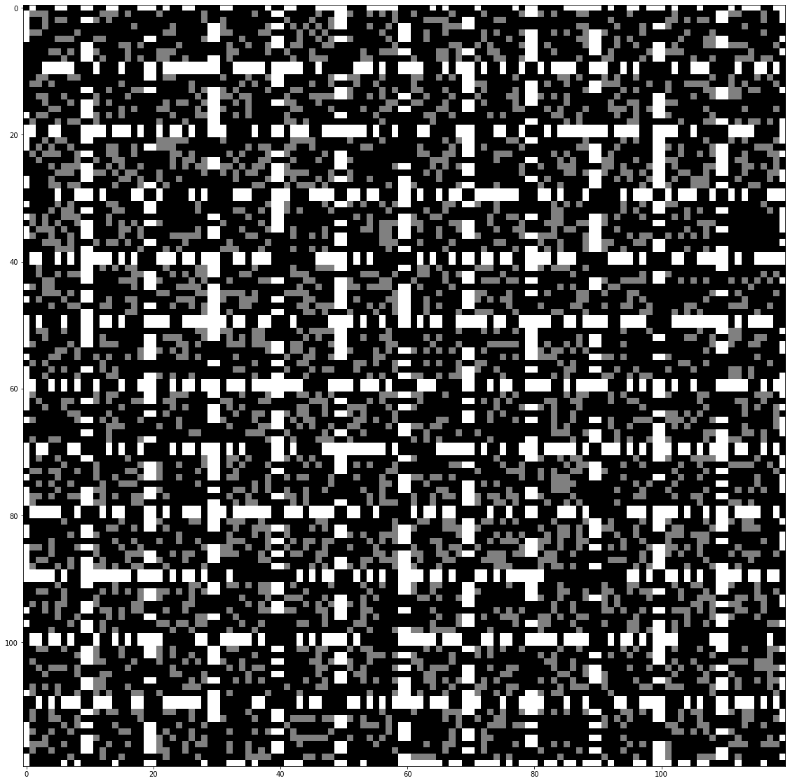


```python
# Looks good. Now strip out the  alignment frames
def make_true_arr(datalist):
    datcols = list()
    for datrow in datalist:
        datrow2 = list()
        for arr in datrow:
            datrow2.append(arr[1:-1, 1:-1])
        datcols.append(np.concatenate(datrow2, axis=1))
    return np.concatenate(datcols, axis=0)

puzpcs = PuzzPieces(copy.deepcopy(puzdict2))
arr2 = make_true_arr(puzpcs.list_of_rows)
```


```python
fig, ax = plt.subplots(nrows=1, ncols=1, figsize=(20, 20))
ax.imshow(arr2, cmap='gray')
```


    <matplotlib.image.AxesImage at 0x2f529621470>


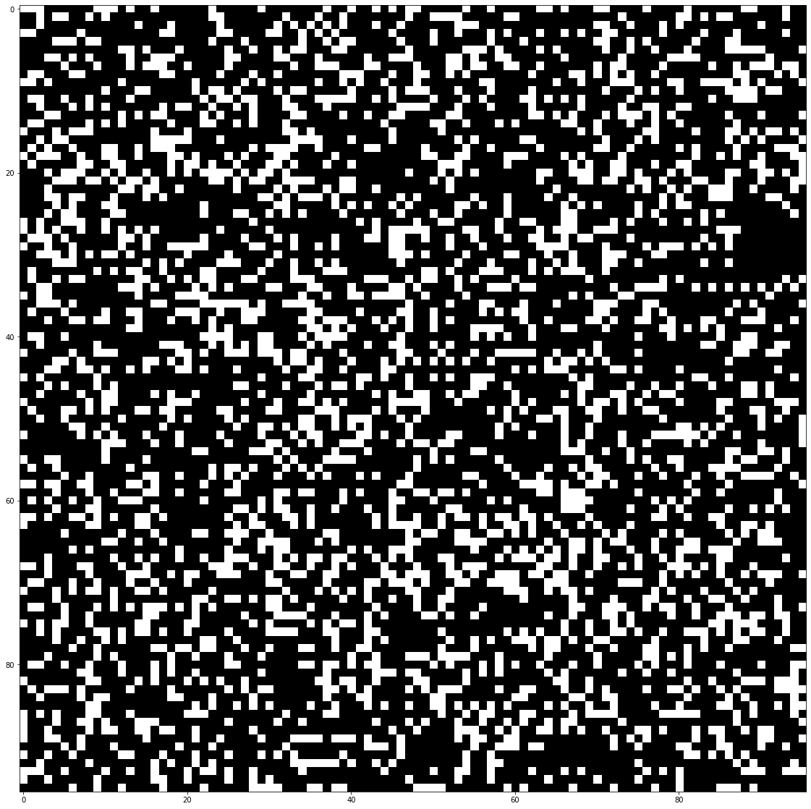


```python
sea_monster = """\
                  # 
#    ##    ##    ###
 #  #  #  #  #  #   """
sea_monster = sea_monster.replace(' ', '0')
sea_monster = sea_monster.replace('#', '1')
mon_list = list()
for l in sea_monster.splitlines():
    mon_list.append([int(x) for x in l])
mon_list
```


    [[0, 0, 0, 0, 0, 0, 0, 0, 0, 0, 0, 0, 0, 0, 0, 0, 0, 0, 1, 0],
     [1, 0, 0, 0, 0, 1, 1, 0, 0, 0, 0, 1, 1, 0, 0, 0, 0, 1, 1, 1],
     [0, 1, 0, 0, 1, 0, 0, 1, 0, 0, 1, 0, 0, 1, 0, 0, 1, 0, 0, 0]]


```python
mon_arr = np.array(mon_list, dtype=np.uint8)
plt.imshow(mon_arr)
```


    <matplotlib.image.AxesImage at 0x2f529356518>


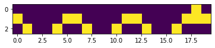


```python
arr3 = arr2.copy()
state = 'UNFLIPPED'
for j in range(2):
    for i in range(4):
        rot = "ROTATED {} TIMES".format(i)
        corr = signal.correlate2d(mon_arr, np.rot90(arr3, i))
        fig, ax = plt.subplots(nrows=1, ncols=1, figsize=(5, 5))
        ax.set_title("{}; {}".format(state, rot))
        ax.imshow(corr)
    state = 'FLIPPED'
    arr3 = np.fliplr(arr2)
```


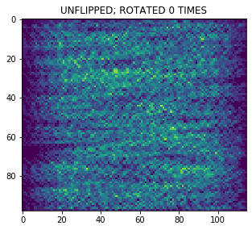


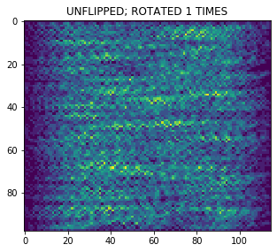


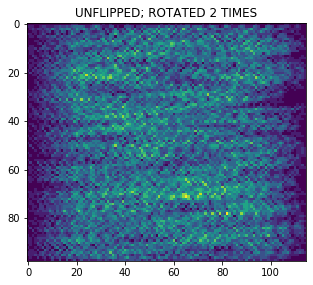


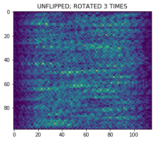


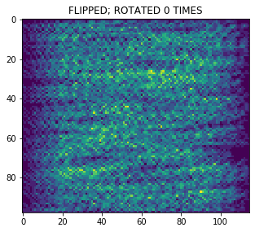


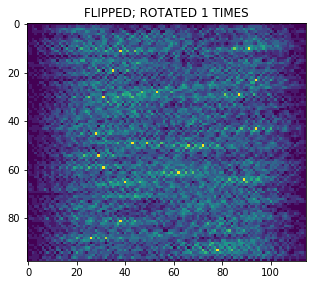


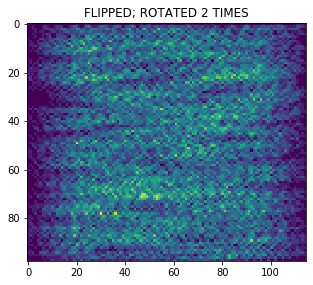


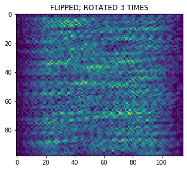


```python
# The best cross-correlation with definitive sea-monster matches
# observable as solitary peaks in the image is "FLIPPED; ROTATE 1 TIMES".
# Transform our array accordingly:
# Flip L/R and rot90 1
arr4 = np.rot90(np.fliplr(arr2), 1)
corr = signal.correlate2d(mon_arr, arr4)
fig, ax = plt.subplots(nrows=1, ncols=1, figsize=(10, 10))
ax.imshow(corr, cmap='viridis')
```


    <matplotlib.image.AxesImage at 0x2f529b43710>


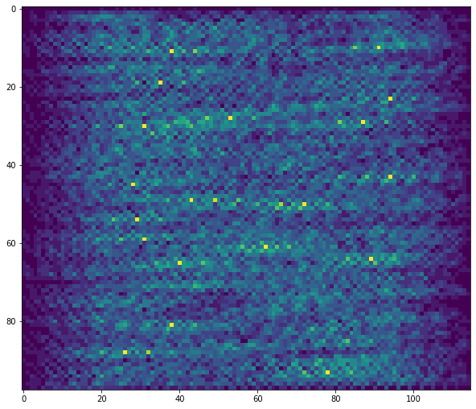


```python
fig, ax = plt.subplots(nrows=1, ncols=1, figsize=(20, 20))
ax.imshow(arr4, cmap='gray')
```


    <matplotlib.image.AxesImage at 0x2f529bee828>


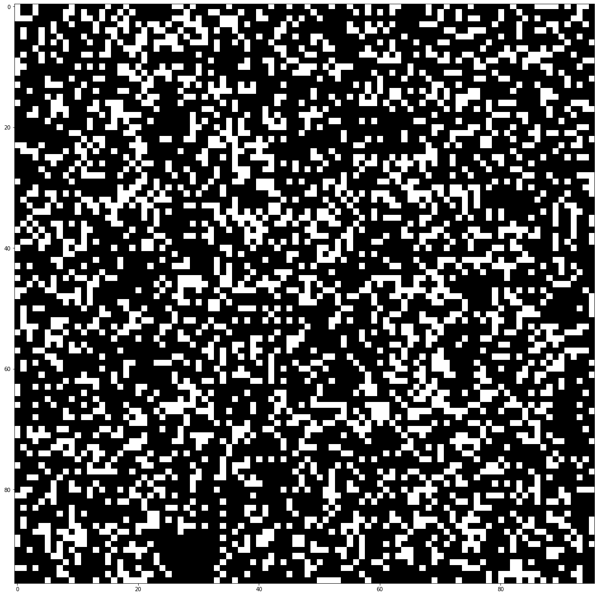


```python
# Boxcar the seamonster through the array.
# Wherever all of his 1 bits overlap with 1 bits
# in the sea then we have a monster there.
```


```python
ht, wd = arr4.shape
(ht, wd)
```


    (96, 96)


```python
mht, mwd = mon_arr.shape
(mht, mwd)
```


    (3, 20)


```python
arr5 = arr4.copy()
# Get indices for placing corner of the monster
iin = np.ndindex((ht-mht, wd-mwd))
for r, c in iin:
    subarr = arr5[r:r+mht, c:c+mwd]
    if np.all(mon_arr * subarr == mon_arr):
        # Highlight the sea monsters
        subarr += mon_arr
```


```python
fig, ax = plt.subplots(nrows=1, ncols=1, figsize=(20, 20))
ax.imshow(arr5, cmap='viridis')
```


    <matplotlib.image.AxesImage at 0x2f5296215c0>


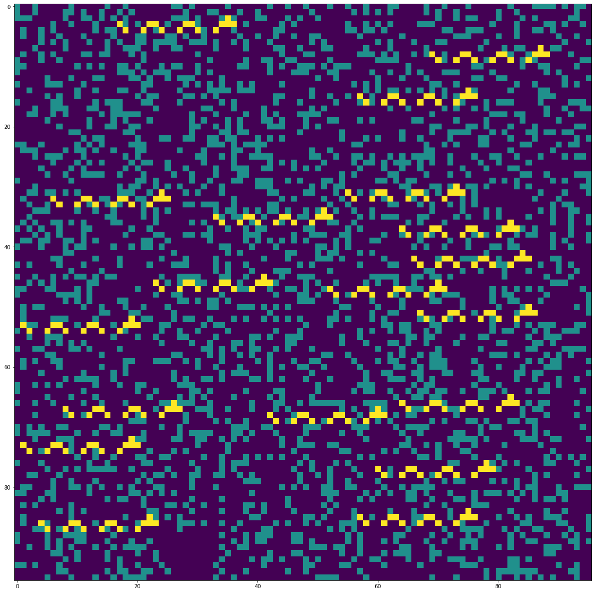


```python
# Wherever the array value is still one is "rough water"
# for us to count towards the solution
Markdown("The amount of rough waters in the sea monster' habitat is "
         "**{}**".format(np.sum(arr5 == 1)))
```


The amount of rough waters in the sea monster' habitat is **2376**


```python

```
